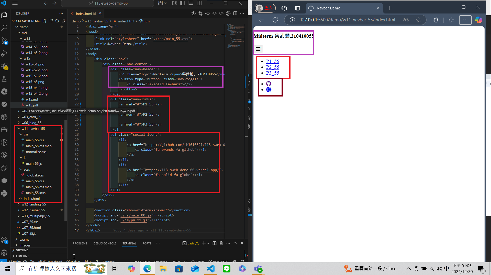

[My Github URL](https://github.com/210410055/113-sweb-demo-55)

### W11-P1: Create html code for navbar



```
9891a54 thl010521       Sat Nov 23 21:34:39 2024 +0800  W11-P1: Create html code for navbar
```

---

### W11-P2: Use sass to convert scss/main_xx.scss to css/main_xx.css


```
296a5ee thl010521       Sat Nov 23 21:35:26 2024 +0800  W11-P2: Use sass to convert scss/main_xx.scss to css/main_xx.css
```

---

### W11-P3: scss for small screen


```
af59aec thl010521       Sat Nov 23 21:36:00 2024 +0800  W11-P3: scss for small screen
```

---

### W11-P4: css for larger screen


```
291bf84 thl010521       Sat Nov 23 21:37:01 2024 +0800  W11-P4: css for larger screen
```

---

### W11-logs: git logs of W11


```
$ git log --pretty=format:"%h%x09%an%x09%ad%x09%s" --after="2024-11-22"

f122311 210410055       Mon Dec 30 14:25:25 2024 +0800  W11-P4: css for larger screenrger screen                         mall screen
f815126 210410055       Mon Dec 30 14:12:42 2024 +0800  W11-P3: scss for sss to convert scss/mainmall screen
b78bd28 210410055       Mon Dec 30 13:41:59 2024 +0800  ### W11-P2: Use sal code for navbar      ss to convert scss/main_xx.scss to css/main_xx.css
85594f4 210410055       Mon Dec 30 13:12:11 2024 +0800  W11-P1: Create html code for navbar


```
