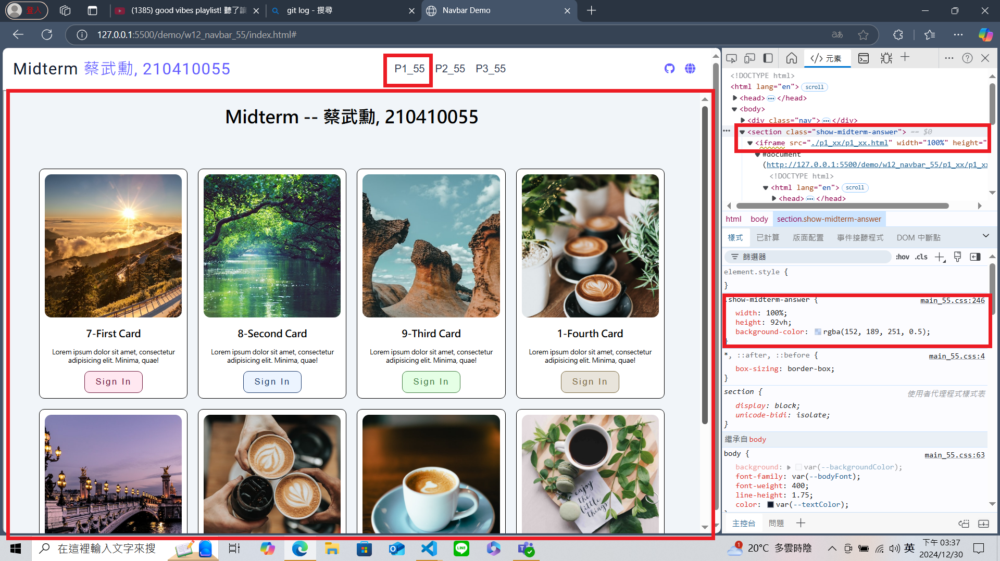
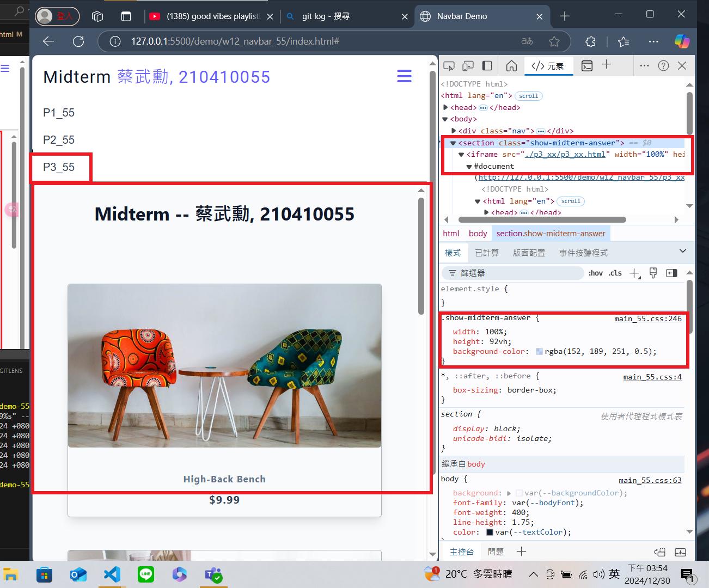
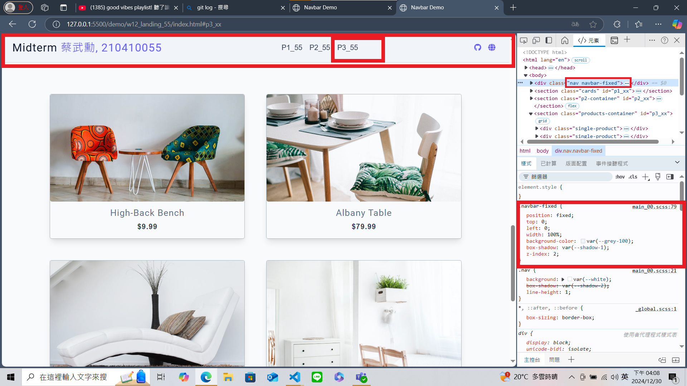
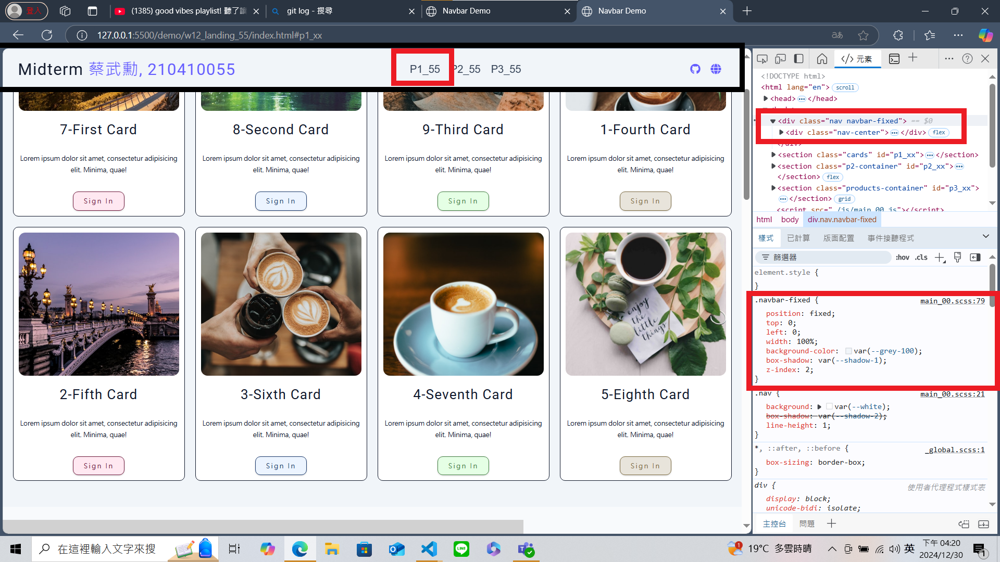
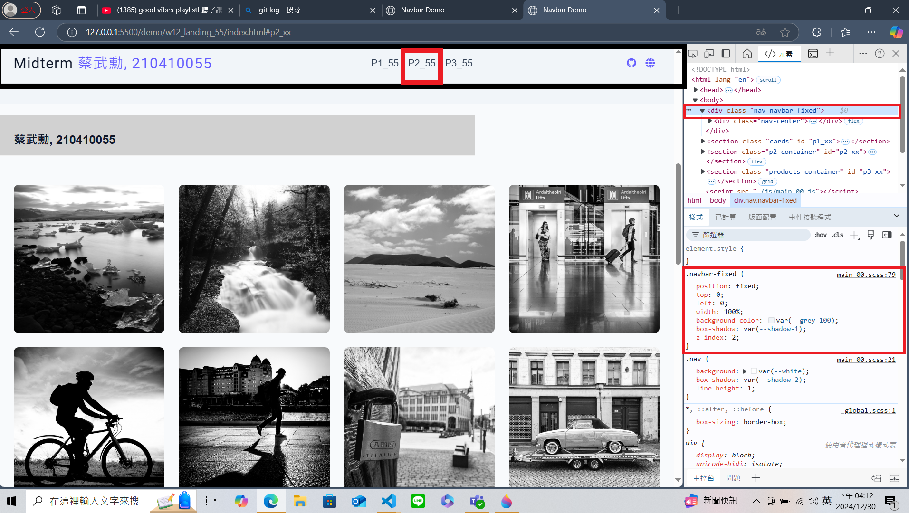

[My Github URL](https://github.com/210410055/113-sweb-demo-55)

### W12-P1: Show annser of p1_xx, p2_xx, p3_xx in midterm exam

#### => show p1_xx




#### => show p2_xx


#### => show p3_xx




```

```

---

### W12-P2: Embed p1_xx, p2_xx, p3_xx content into index.html, and make it to work correctly

#### => select p3_xx nav link, navbar-fixed will be displayed



#### => select p1_xx nav link, navbar-fixed will be removed



#### => select p2_xx nav link, navbar-fixed will be displayed



```

```

---

### W12-logs: git logs of W12

```
$ git log --pretty=format:"%h%x09%an%x09%ad%x09%s" --after="2024-11-29"
59d190b thl010521       Sat Nov 30 23:21:22 2024 +0800  W12-P2: Embed p1_xx, p2_xx, p3_xx content into index.html, and make it to work correctly
a36215b thl010521       Sat Nov 30 23:15:20 2024 +0800  W12-P1: Show annser of p1_xx, p2_xx, p3_xx in midterm exam
a95f5a7 thl010521       Sat Nov 30 23:13:41 2024 +0800  w12 navbar & landing code and md


```
