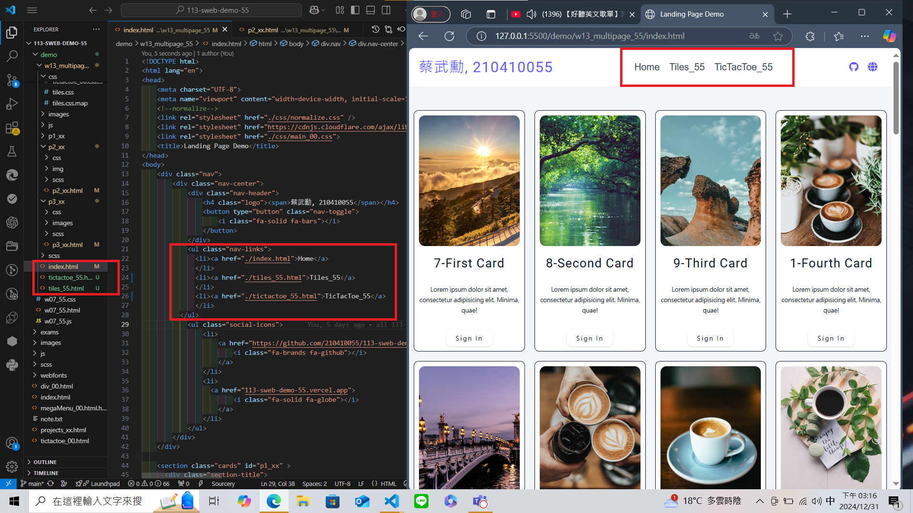
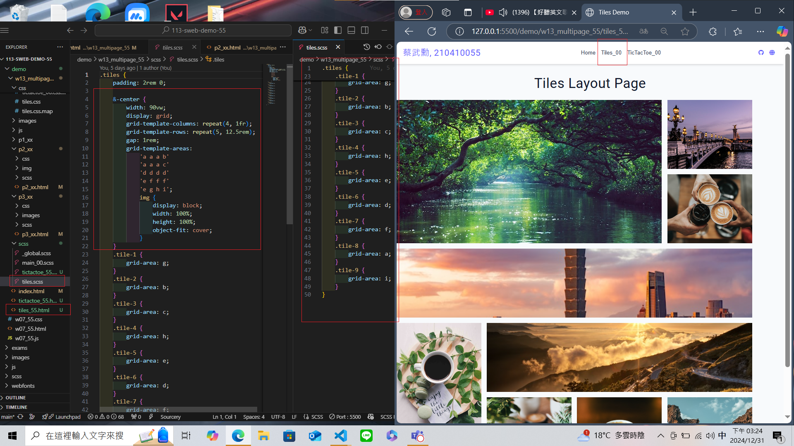
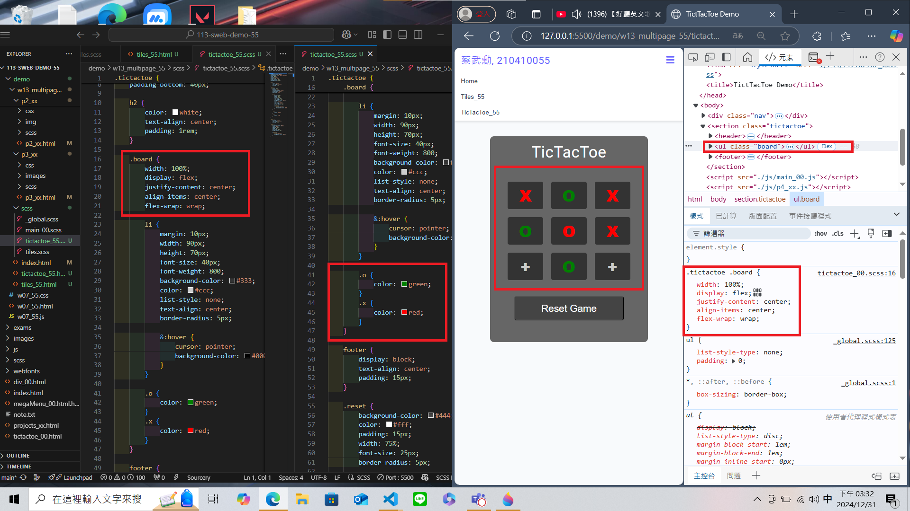

[My Github URL](https://github.com/210410055/113-sweb-demo-55)

### W13-P1: Create tiles_xx.html and tictactoe_xx.htmml with the same navbar as in index.html



```
2fb2dad thl010521       Sat Dec 7 17:01:54 2024 +0800   W13-P1: Create tiles_xx.html and tictactoe_xx.htmml with the same navbar as in index.html
```

---

### W13-P2: Make tiles_xx.html work using tiles_xx.scss



```
ed87a17 thl010521       Sat Dec 7 17:03:28 2024 +0800   W13-P2: Make tiles_xx.html work using tiles_xx.scss
```

---

### W13-P3: Make tictactoe_xx.html work using tictactoe_xx.scss



```
6230a17 thl010521       Sat Dec 7 17:04:07 2024 +0800   W13-P3: Make tictactoe_xx.html work using tictactoe_xx.scss
```

---

### W13-logs: git logs of W13

```
$ git log --pretty=format:"%h%x09%an%x09%ad%x09%s" --after="2024-12-06"

9139518 210410055       Tue Dec 31 15:38:37 2024 +0800  W13-P3: Make tictactoe_xx.html work using tictactoe_xx.scss
490326a 210410055       Tue Dec 31 15:37:54 2024 +0800  W13-P2: Make tiles_xx.html work using tiles_xx.scss
b330923 210410055       Tue Dec 31 15:36:18 2024 +0800  W13-P1: Create tiles_xx.html and tictactoe_xx.htmml with the same navbar as in index.html


```
