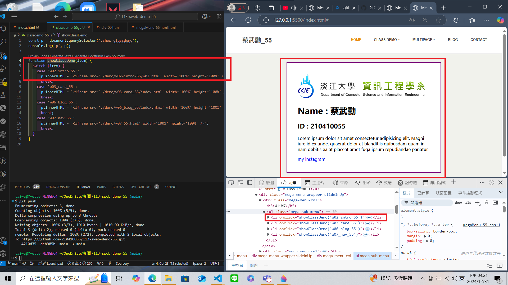
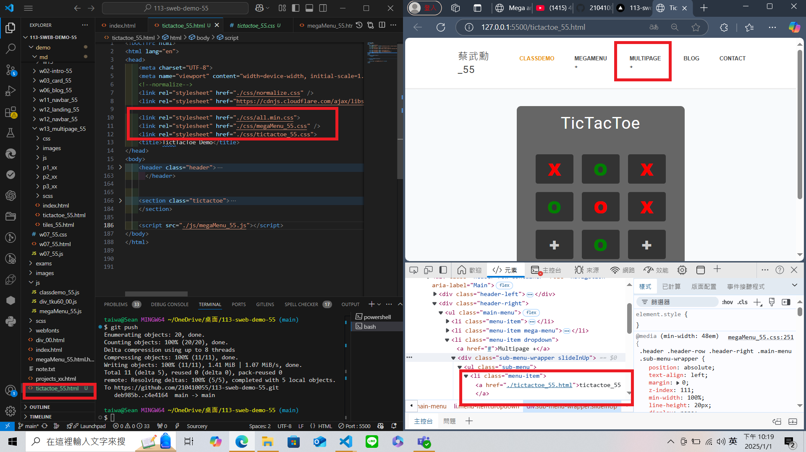
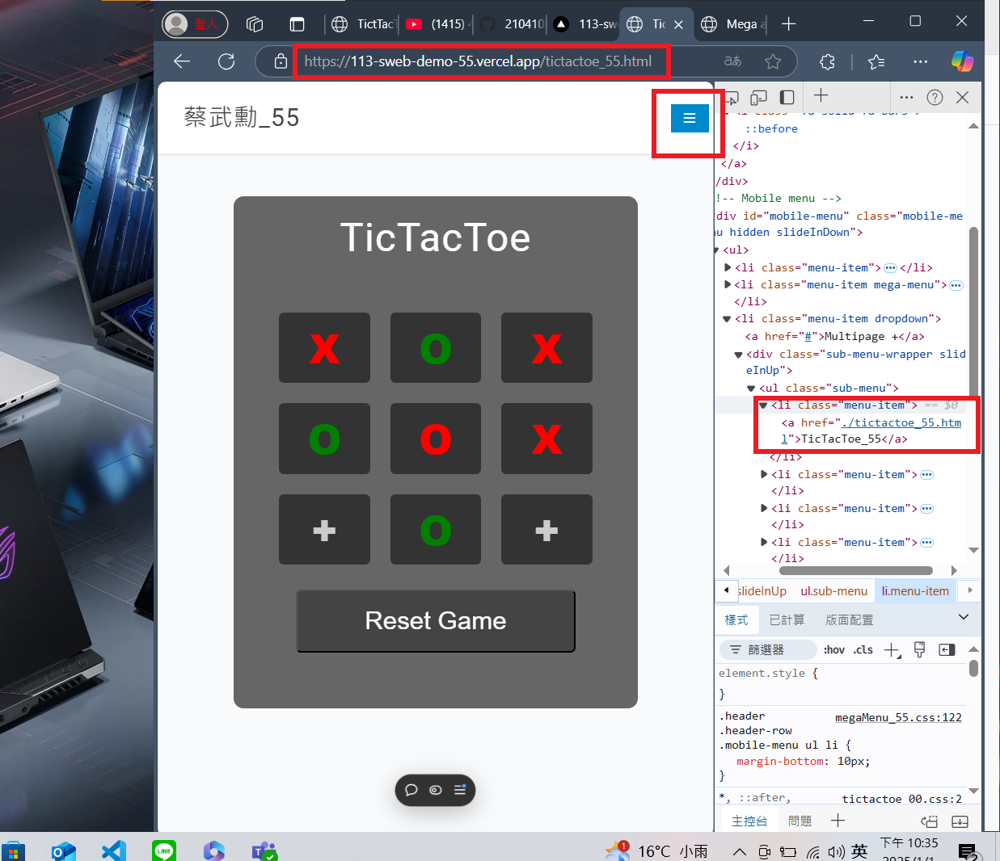

[My Github URL](https://github.com/210410055/113-sweb-demo-55)

### W14-P1: Setup mega menu to replace index.html in the home directory

#### => Show in local


#### => Show in Vercel


```
fb79960 thl010521       Thu Dec 12 21:52:39 2024 +0800  W14-P1: Setup mega menu to replace index.html in the home directory
```

---

### W14-P2: Show class demo of w2, w3, w6 in both local and Vercel

#### => Show in local for w2



#### => Show in local for w3


#### => Show in Vercel for w6


```
49b397a thl010521       Thu Dec 12 21:53:24 2024 +0800  W14-P2: Show class demo of w2, w3, w6 in both local and Vercel
```

---

### W14-P3: Add tictactoe multipage

#### => Show in local



#### => Show in Vercel



```
96cb18c thl010521       Thu Dec 12 21:54:04 2024 +0800  W14-P3: Add tictactoe multipage
```

---

### W14-logs: git logs of W14

```
$ git log --pretty=format:"%h%x09%an%x09%ad%x09%s" --after="2024-12-11"

96cb18c thl010521       Thu Dec 12 21:54:04 2024 +0800  W14-P3: Add tictactoe multipage
49b397a thl010521       Thu Dec 12 21:53:24 2024 +0800  W14-P2: Show class demo of w2, w3, w6 in both local and Vercel
fb79960 thl010521       Thu Dec 12 21:52:39 2024 +0800  W14-P1: Setup mega menu to replace index.html in the home directory


```
