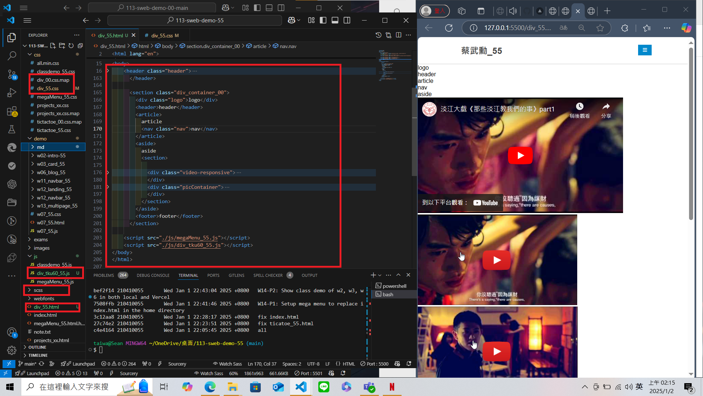
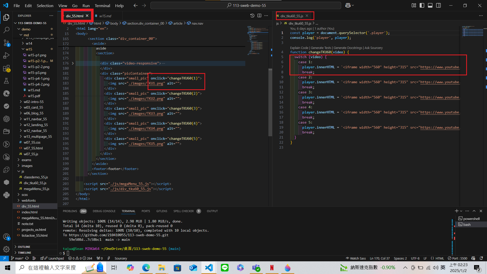
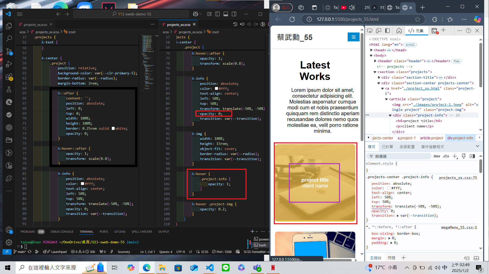

[My Github URL](https://github.com/210410055/113-sweb-demo-55)

### W15-P1: Setup div_xx.html, div_xx.scss, div_tku60_xx.js



```
6f2cc2d thl010521       Mon Dec 23 02:00:13 2024 +0800  W15-P1: Setup div_xx.html, div_xx.scss, div_tku60_xx.js
```

---

### W15-P2: Show div_xx.html correctly

#### => select tku60 pic 3, and show relevant youtube video


#### => html, and js code for showing video 3



```
d987f4a thl010521       Mon Dec 23 02:01:06 2024 +0800  W15-P2: Show div_xx.html correctly
```

---

### W15-P3: make P2 div_xx.html responsive


```
df9e72d thl010521       Mon Dec 23 02:01:45 2024 +0800  W15-P3: make P2 div_xx.html responsive
```

---

### W15-P4: show absolute positioning in project_xx.html




```
3845720 thl010521       Mon Dec 23 02:02:23 2024 +0800  W15-P4: show absolute positioning in project_xx.html
```

---

### W15-logs: git logs of W15

```
$ git log --pretty=format:"%h%x09%an%x09%ad%x09%s" --after="2024-12-22"

3845720 thl010521       Mon Dec 23 02:02:23 2024 +0800  W15-P4: show absolute positioning in project_xx.html
df9e72d thl010521       Mon Dec 23 02:01:45 2024 +0800  W15-P3: make P2 div_xx.html responsive
d987f4a thl010521       Mon Dec 23 02:01:06 2024 +0800  W15-P2: Show div_xx.html correctly
6f2cc2d thl010521       Mon Dec 23 02:00:13 2024 +0800  W15-P1: Setup div_xx.html, div_xx.scss, div_tku60_xx.js
d19e2d6 thl010521       Mon Dec 23 01:58:22 2024 +0800  w15 code - div_00 & projects_xx


```
