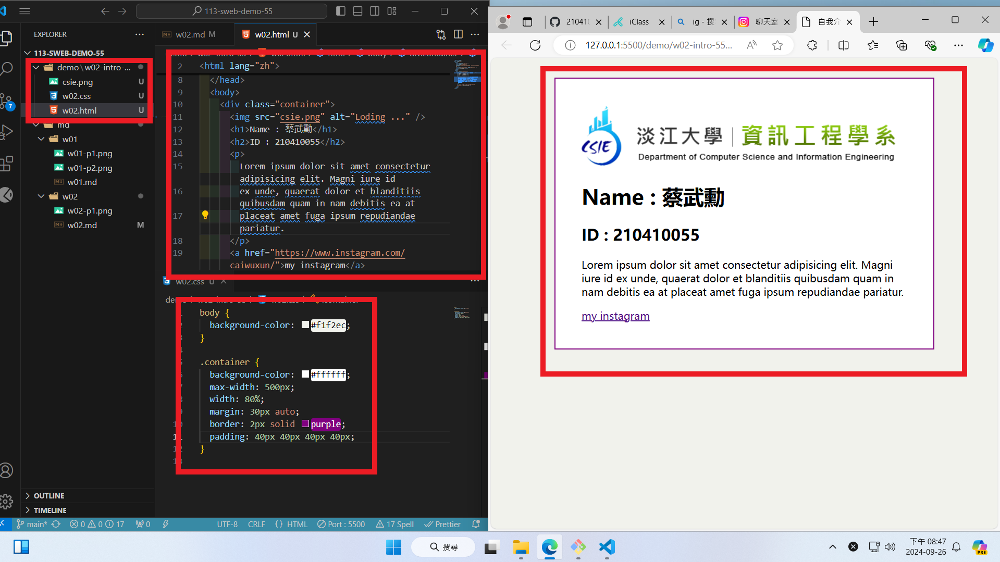

### github URL

[My github URL](https://github.com/210410055/113-sweb-demo-55)

### w02-p1:Collaborate your Github repo to htchung@gms.tku.edu.tw and sian-0018


### My Introduction using html with css selector(container)



### w02-p3: git logs of w2

```
”d92a6e7        210410055       Thu Sep 19 21:11:11 2024 +0800        w02-p2“
”9e3e874        210410055       Thu Sep 19 20:00:09 2024 +0800        w02-p1“
```
