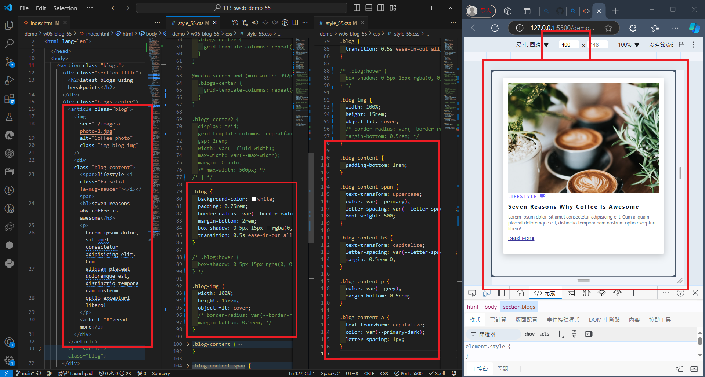
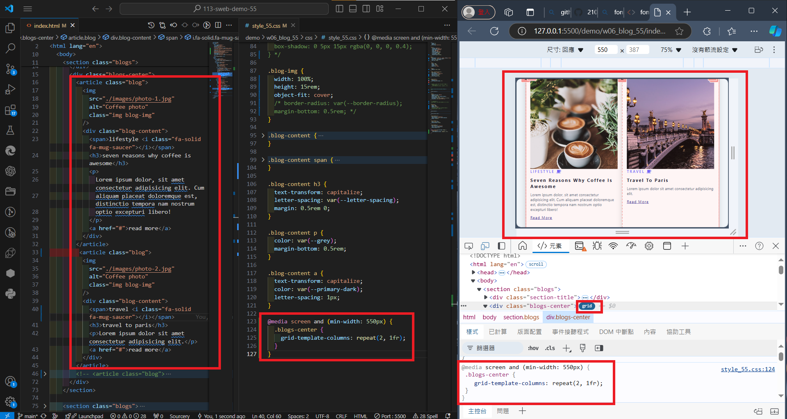
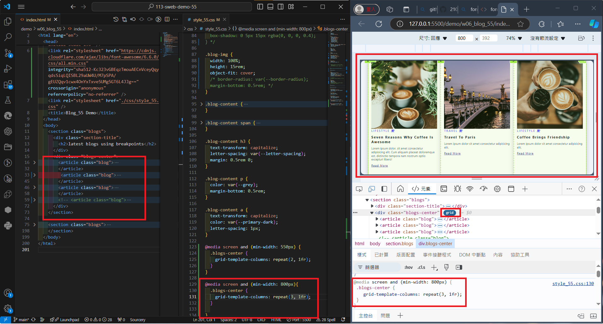
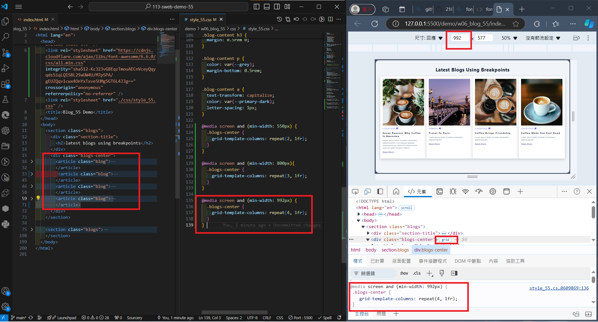
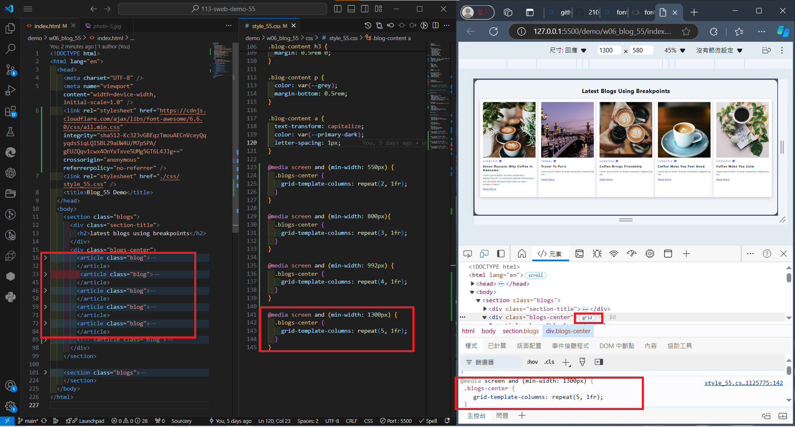
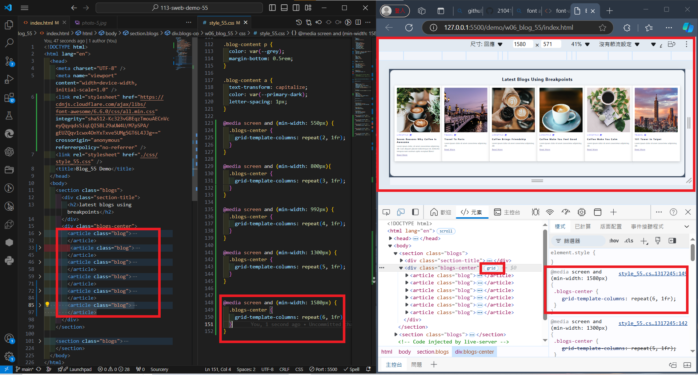

### github URL

[My github URL](https://github.com/210410055/113-sweb-demo-55)

### W06-P1: Create a blog, using html and css as specified
 


### W06-P2: Show 2 blogs in a row with media query min-width: 550px


### W06-P3: Show 3 blogs in a row with media query min-width: 800px


### W06-P4: Show 4~6 blogs in a row with media query. You need to determine the min-width for each.
 
#### => 4 blogs in a row
 

 
#### => 5 blogs in a row
 

 
#### => 6 blogs in a row
 


```
$ git log --pretty=format:"%h%x09%an%x09%ad%x09%s" --after="2024-10-21"
98522d0 210410055       Tue Oct 22 12:35:57 2024 +0800  ### W06-P4: Show 4~6 blogs in a row with media query. You need to determine the min-width for each.
f00f679 210410055       Tue Oct 22 12:34:58 2024 +0800  ### W06-P3: Show 3 blogs in a row with media query min-width: 800px
53eb032 210410055       Tue Oct 22 12:33:18 2024 +0800  ### W06-P2: Show 2 blogs in a row with media query min-width: 550px
7dd4db9 210410055       Tue Oct 22 12:32:10 2024 +0800  W06-P1: Create a blog, using html and css as specified
```
 